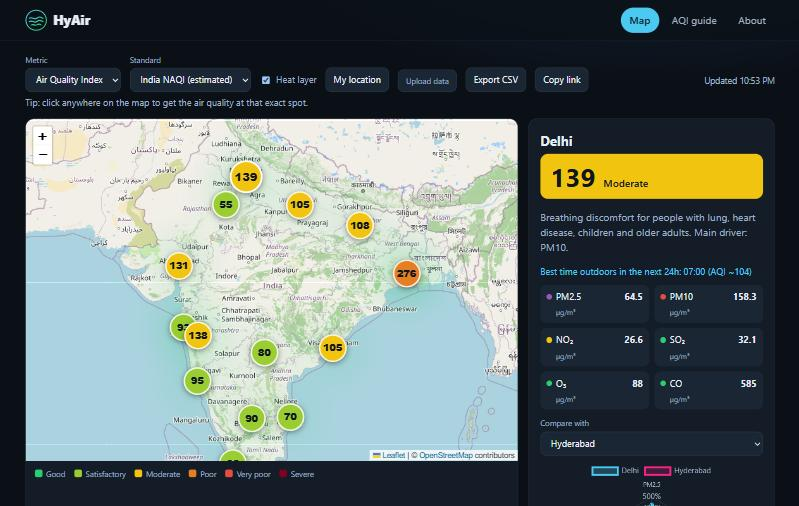

# HyAir - Live Air Quality Map

Interactive air quality explorer for 14 Indian cities, built with plain ES modules (no build step).

**Live demo: https://rushilswork.github.io/HyAir-Data-Visualization-Tool/**


**Stack:** vanilla JavaScript (ES modules) · Leaflet · Chart.js · Open-Meteo API · `node:test`. Hosted free on GitHub Pages; there is no backend and no stored user data (uploaded files are processed in the browser).



**Features**
- Live readings (PM2.5, PM10, NO₂, SO₂, O₃, CO, AQI) from the free [Open-Meteo Air Quality API](https://open-meteo.com/en/docs/air-quality-api), no API key needed
- **US AQI** and an estimated **India NAQI** (CPCB breakpoints), switchable
- Colour-coded map, optional heat layer, city rankings and bar chart
- Click anywhere on the map, or use *My location*, to get air quality for that exact spot
- 3-day history + 3-day forecast trend, and a "best time outdoors" hint
- Pollutant radar with city-to-city comparison (as % of WHO guideline)
- Health advice for each AQI band, an [AQI guide](guide.html), CSV export, shareable links (`?city=delhi&metric=pm2_5&std=in`)
- Upload your own data (`lat,lon,aqi,pm2.5,pm10,so2,o3,co,no2,city`, see [sample-upload.csv](sample-upload.csv))
- Responsive and keyboard accessible: zero axe-core WCAG 2.1 AA violations; text colour is chosen per AQI band to keep contrast at 4.5:1 or better (unit-tested)
- Readings are cached for 5 minutes per tab to limit API calls; no secrets in the client

## Run

ES modules need http (not `file://`):

```bash
npx serve .
```

```bash
npm test
```

## Notes on the data
Values are **modelled** (CAMS, ~11 km grid), not single ground-sensor readings. NAQI is computed from hourly values although the official index uses 24h/8h averages, so it is an estimate.

## Layout
| File | Purpose |
|---|---|
| `js/aqi.js` | Pure AQI logic: NAQI, bands, upload parser (unit-tested) |
| `js/api.js` | Open-Meteo client |
| `js/app.js` | Map, charts, UI |
| `js/cities.js` | City list |
| `test/` | `node:test` unit tests |

## Hosting
Static site, deployed on GitHub Pages from `main` (Settings → Pages → Deploy from a branch → `/ (root)`).

Started as a Hyderabad-only map; now covers 14 cities across India.

## Limitations
- Values are modelled (CAMS, ~11 km grid), not single ground sensors, so a monitor near you may differ.
- NAQI is an estimate: the official index uses 24 h/8 h averages and this app uses the latest hourly value.
- Depends on the free Open-Meteo API (non-commercial use, daily call limits) and OpenStreetMap tiles.
- Tests cover the AQI logic and API client; there are no browser end-to-end tests.

## License
MIT, see [LICENSE](LICENSE).
